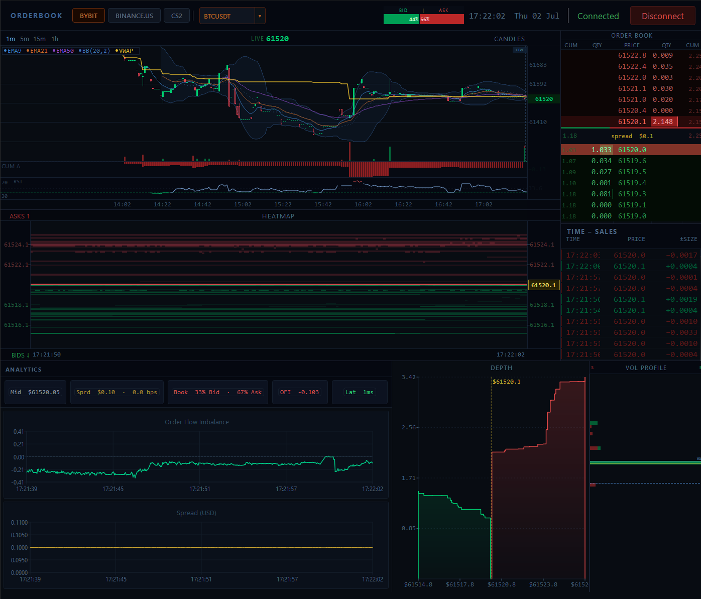
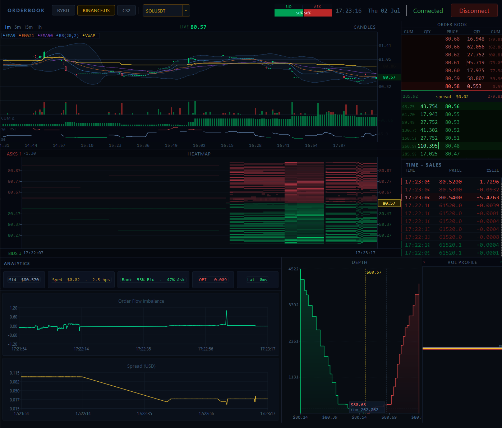
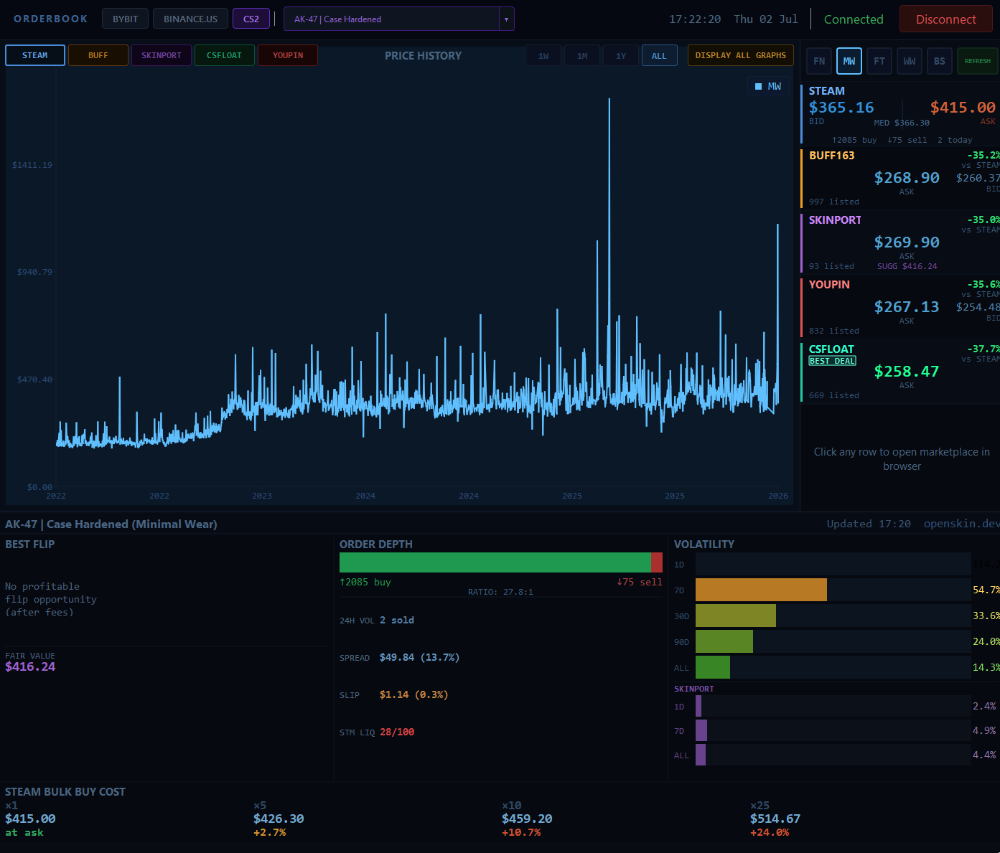
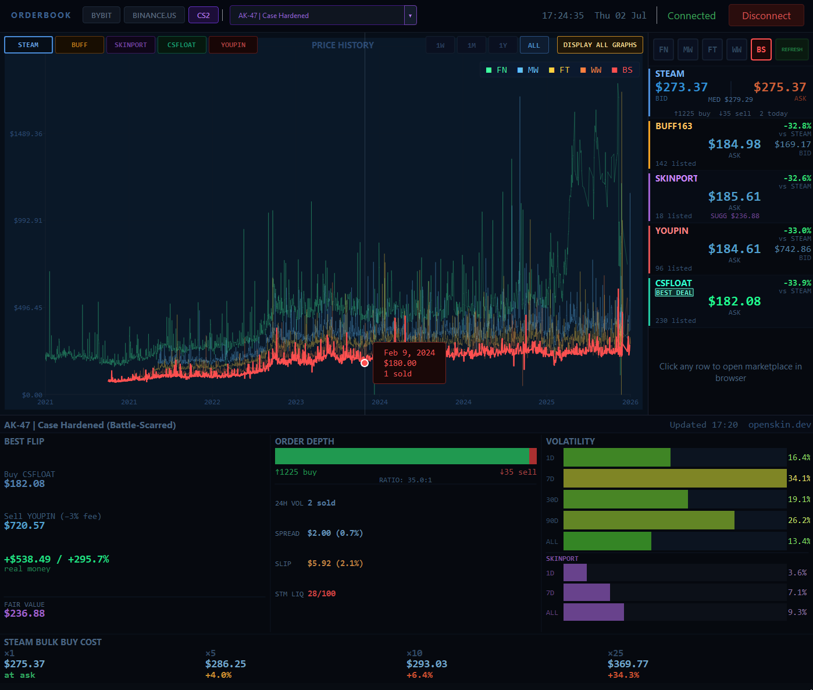

# Tickrate

A live market data terminal built in **C++17 and Qt6**. It connects to **Bybit** and **Binance.US** over WebSocket for real-time crypto order flow, and pulls CS2 skin pricing across multiple marketplaces via the OpenSkin API.

All rendering is done through custom QPainter widgets with no QML and no third-party chart libraries, so every pixel is under direct control.

---

## What it does

### Crypto dashboard (Bybit / Binance.US)

| Panel | Description |
|---|---|
| **Candlestick Chart** | OHLCV candles with VWAP (daily reset), EMA 9/21/50, Bollinger Bands, Cumulative Delta sub-chart, RSI, footprint mode at high zoom, right-click price alerts |
| **DOM Ladder** | Bid/ask depth table with cumulative and raw quantity columns, quantity bars scaled to a rolling max, live trade flash |
| **Heatmap** | Scrolling price-by-time order book history with intensity-coded resting liquidity |
| **Depth Chart** | Cumulative bid/ask step chart with gradient fill and crosshair tooltip |
| **Volume Profile** | Session volume by price bin with POC, Value Area High/Low (70% rule) |
| **Time and Sales** | Trade tape with EMA-based 5-tier size classification and signed size column |
| **Analytics** | Mid price, spread, OFI, Cumulative Delta, clock-skew-adjusted latency, and live OFI/spread charts |

### CS2 skin dashboard

| Panel | Description |
|---|---|
| **Price History** | Per-wear line chart (FN/MW/FT/WW/BS) across Steam, Buff, Skinport, CSFloat, and YouPin |
| **Market Stats** | Live ask/bid/median per wear across all marketplaces with a market health indicator |
| **Marketplace Listings** | Current listings with float value, price, and wear tier |
| **Float Histogram** | Float distribution across active listings |
| **Float vs Price Scatter** | Scatter plot of float vs price for spotting underpriced listings |

### Also

- Multi-symbol support: BTCUSDT, ETHUSDT, SOLUSDT, XRPUSDT, plus free-text entry
- One-click exchange toggle: Bybit, Binance.US, or CS2
- Candle history seeded from REST on connect, then streamed live over WebSocket
- Session state (symbol, exchange, interval, window geometry) persisted with QSettings
- Right-click any price level on the candle chart to set an alert: beep + status bar flash on crossing

---

## Screenshots

**Bybit - BTCUSDT live feed** (candles with EMA/BB/VWAP, heatmap, order book ladder, time and sales, analytics, depth chart, volume profile)



**Binance.US - SOLUSDT live feed** (same layout; notable buy-side wall visible in the heatmap)



**CS2 - AK-47 Case Hardened (Minimal Wear)** (price history, market stats across 5 marketplaces, order depth, volatility metrics, bulk-cost calculator)



**CS2 - AK-47 Case Hardened (all wears overlaid, crosshair tooltip active)** (Battle-Scarred selected; all five wear lines shown; best-flip arbitrage panel with real P/L)



---

## Architecture

```
+--------------------------------------------------------+
|  MainWindow  (orchestrator, 33ms render timer)         |
|                                                        |
|  BybitClient / BinanceClient / OpenSkinClient          |
|  +-- WebSocket -> orderBookUpdated(OrderBookUpdate)    |
|  +-- WebSocket -> tradeReceived(TradeInfo)             |
|  +-- REST (OpenSkin API) -> CS2 prices / history       |
|                                                        |
|  core/Types.h     zero-dependency shared domain types  |
|  OrderBook        bid/ask maps, O(log n) apply/snap    |
|  Analytics        OFI, cumulative delta, latency       |
|                                                        |
|  util/Indicators.h  pure indicator math (header-only)  |
|  +-- computeEma(closes, period) -> vector<double>      |
|  +-- VwapAccumulator  running VWAP, midnight reset     |
|  +-- tradeTier(size, ema, count) -> 1..5               |
|  +-- fpTickSize(price) -> tick grid size               |
|  +-- computeValueArea(binVols) -> POC/VAH/VAL          |
|                                                        |
|  Widgets (all custom QPainter, no QML)                 |
|  -- Crypto ------------------------------------------  |
|  +-- CandlestickWidget   candles, VWAP, EMA, CumDelta  |
|  +-- OrderBookLadder     DOM table                     |
|  +-- HeatmapWidget       liquidity heatmap             |
|  +-- DepthChartWidget    cumulative depth              |
|  +-- VolumeProfileWidget POC / VAH / VAL               |
|  +-- TapeWidget          time and sales                |
|  +-- AnalyticsPanel      OFI + spread charts           |
|  -- CS2 ---------------------------------------------  |
|  +-- CS2PriceChartWidget   per-wear price history      |
|  +-- CS2MarketStatsWidget  ask/bid/median per market   |
|  +-- CS2MarketplaceWidget  live listings               |
|  +-- FloatHistogramWidget  float distribution          |
|  +-- CS2ScatterWidget      float vs price              |
+--------------------------------------------------------+
```

**Crypto data flow:**
1. Exchange client receives a WebSocket message and emits a Qt signal
2. `MainWindow::onOrderBookUpdated` applies the delta to `OrderBook`, runs `Analytics::update`, sets `m_framePending = true`
3. The 33ms render timer fires `renderFrame()` and pushes snapshots to all widgets
4. Trades fan out immediately to `TapeWidget`, `CandlestickWidget`, `VolumeProfileWidget`, `OrderBookLadder`, and `Analytics`

**CS2 data flow:**
1. `OpenSkinClient` makes REST calls to `api.openskin.dev` for per-wear prices and sale history
2. `CS2MarketClient` manages session state including search debounce and multi-wear lazy loading
3. Price history is converted to `Candle` vectors via `buildCandlesFromSales` and handed to `CS2PriceChartWidget`

**Latency adjustment:**
Raw round-trip is `recvTime - eventTimeMs`. A rolling minimum over 60 samples estimates the static clock skew between local and exchange clocks. Adjusted latency subtracts that minimum, giving roughly 0ms at baseline instead of a constant +1200ms offset that tells you nothing useful.

---

## Build

```bash
cmake -B build -DCMAKE_BUILD_TYPE=Release
cmake --build build --parallel
```

Requires **Qt 6.5+** with `Widgets`, `Charts`, `WebSockets`, `Network`, and `Test`.

### Tests

```bash
cd build && ctest --output-on-failure
```

| Suite | Tests | Covers |
|---|---|---|
| `test_orderbook` | 14 | Delta/snapshot correctness, one-sided book (CS2 mode), sort order |
| `test_analytics` | 18 | OFI sign/magnitude, spread bps, book imbalance, cumulative delta, latency skew |
| `test_cs2candles` | 15 | `buildCandlesFromSales`: OHLCV binning, ISO timestamp parsing, unix timestamp parsing |
| `test_cs2skin` | 20 | `stripWear`/`wearIndex` for all 5 wear tiers, edge cases, wear constants |
| `test_indicators` | 39 | EMA seeding/convergence, VWAP accumulation/midnight reset, trade-size tiers, footprint tick size, Value Area POC/VAH/VAL |

---

## Design notes

- **Custom QPainter widgets**: no QML, no third-party chart libraries. Every pixel is owned, which keeps latency and redraw predictable.
- **Render timer decoupling**: incoming WebSocket data sets a `m_framePending` flag; the 33ms timer coalesces bursts so widgets never redraw more than ~30fps regardless of tick rate.
- **`core/Types.h`**: zero-dependency shared domain types (`PriceLevel`, `TradeInfo`, `Candle`, etc.) that both the UI and network layers include without creating circular dependencies.
- **`util/Indicators.h`**: all pure indicator math (EMA, VWAP, tier classification, value area) in a header-only file with no Qt or widget dependency, making it straightforward to test in isolation.
- **Clock-skew-adjusted latency**: rolling minimum subtraction removes the static offset between exchange and local clocks, so the displayed latency reflects actual network conditions.
- **VWAP using typical price**: `(H+L+C)/3 * volume`, accumulated from UTC midnight, reset each session.
- **EMA seeded from index 0**: exponential warm-up instead of SMA seeding keeps the indicator consistent when historical candles are loaded from REST.
- **Value Area tie-break**: always expand high when both sides are equal, matching standard volume profile convention.
